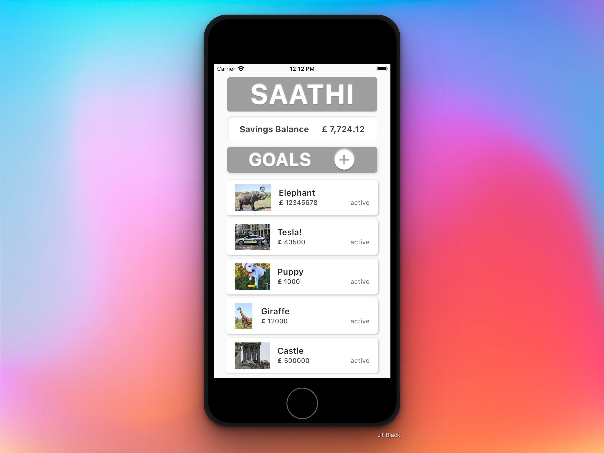
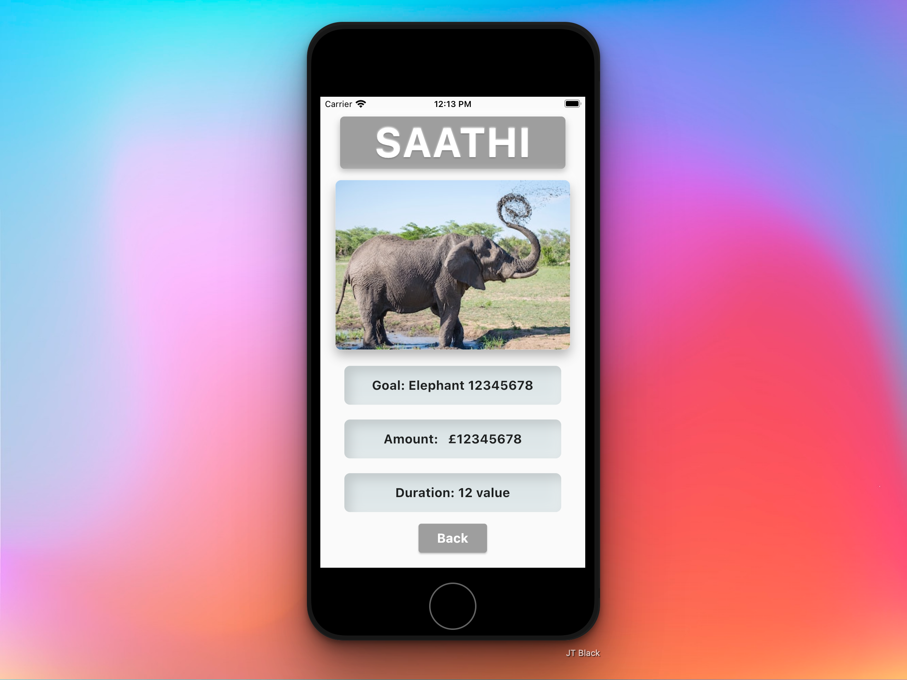
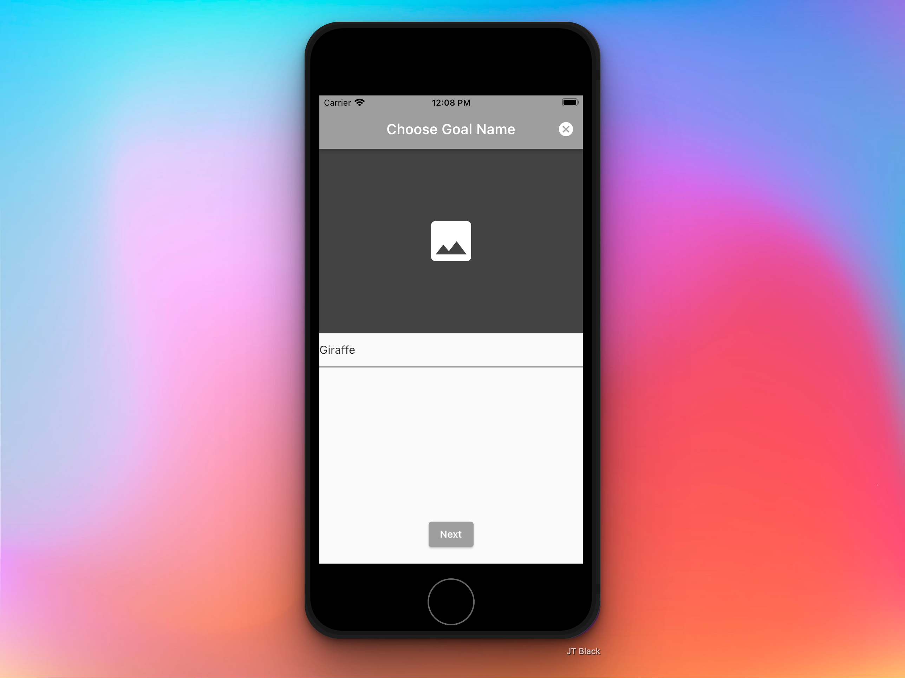
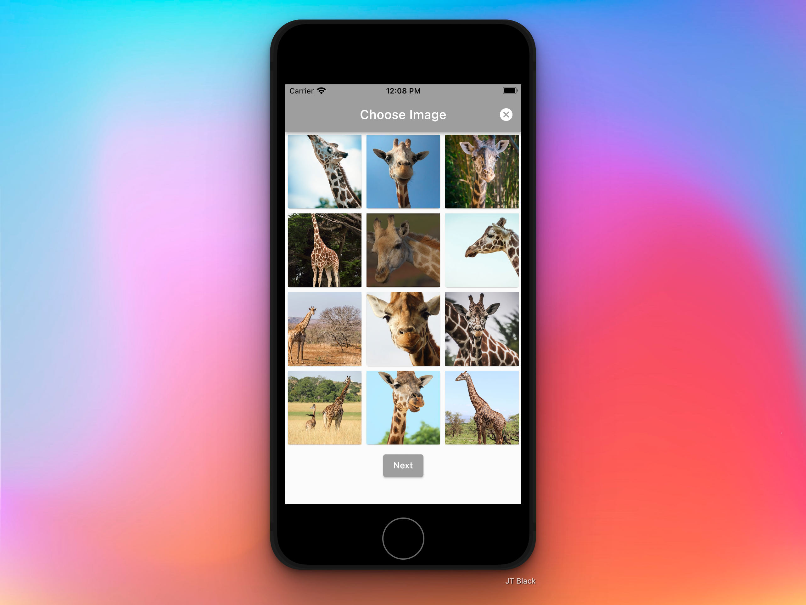
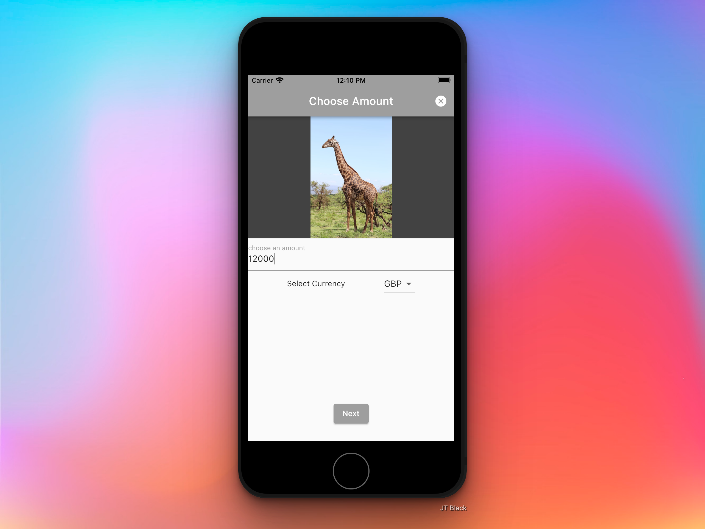
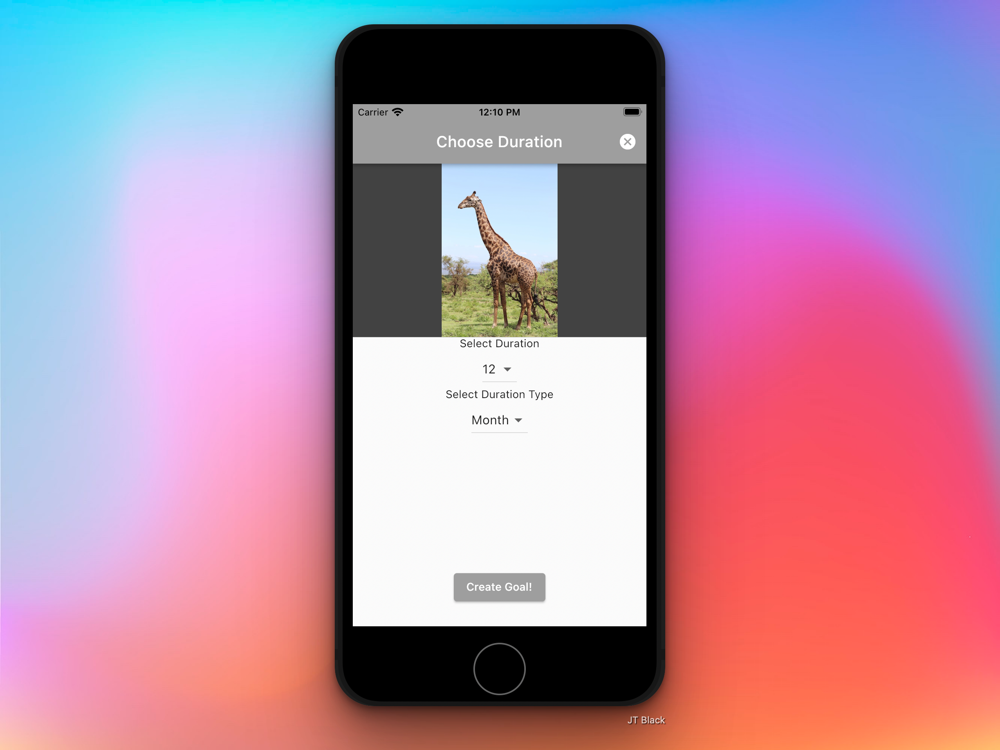

# saathi

A small full stack Flutter app connected to Firestore Cloud that allows a user to add savings goals, select a picture for each goal, and view the goal. The front end is written in Dart using Flutter. The back end API is written with JavaScript and uses Node / Express. The database is Google Firestore. 

## Run The App

- Install Flutter SDK
- Install Android SDK or Apple XCode
- Run mobile emulator
- Install Dependencies
- In Terminal, type the command: flutter run

### Screen Recording

https://user-images.githubusercontent.com/87031124/191955588-6fca4e90-4c97-4a26-a623-9d7c15a68f03.mov

## Screenshots

Home	

  

Single Goal

  

Choose Goal Name

  

Choose Image

  

Choose Amount

  

Choose Duration

  

